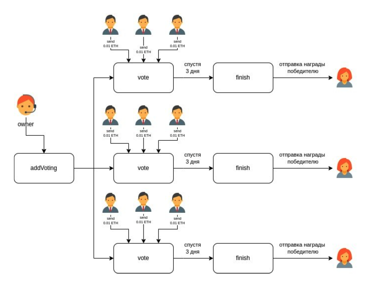

# DAPP Vote (Sample) - Стажера / Junior

Разбираю реальное тестовое на Solidity - разработчика - стажера. 
Тестовое - шикарное, его придумала не я - его дают в более крупной компании. 
Оно прекрасно иллюстрирует, что должен знать и уметь Solidity - разработчик для того, чтобы устроиться на свою первую работу - даже не джуном, а просто стажером, который не получает никакой зарплаты.

***Задача:***
* контракт должен создавать объект голосования, принимая на вход массив адресов кандидатов.
* голосований может быть много, по всем нужно иметь возможность посмотреть информацию.
* голосование длится некоторое время.
* пользователи могут голосовать за кандидата, переводя на контракт эфир.
* по завершении голосования победитель может снять средства, которые были внесены в это голосование, за исключением комиссии площадки.
* владелец площадки должен иметь возможность выводить комиссию.
* покрыть контракт юнит-тестами;
* создать task hardhat для каждой публичной функции;

Плохой пример (я скопировала его к себе, чтобы не смущать его автора): 
https://gist.github.com/BedrosovaYulia/d1f158f5b01f5c8dc5ca984a54d6ff57

---

Example of a survey you may be asked when applying for a job with WEB3 for Junior.

Solidity 0.8.15
HardHat

## Install & Run

* Install dependeces `npm i`
* FrontEnd - In `Site` folder run script `python -m http.server` or `python3 -m http.server`
* For test it `npx hardhat coverage`

### YouTube
Watch the videos on my channel: 
* https://youtu.be/7JGvFIkD1Fk

### Documentation:
* https://docs.google.com/document/d/1Q21PR_tqbJE2pwGaoJbyiiAA4TVlCPquF3c40JWtbtA/edit?usp=sharing